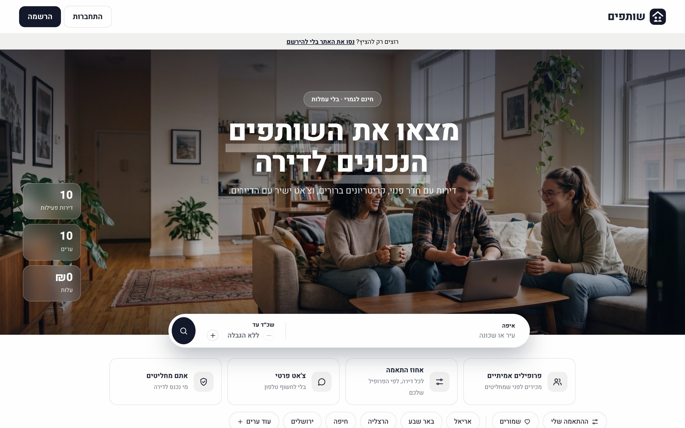
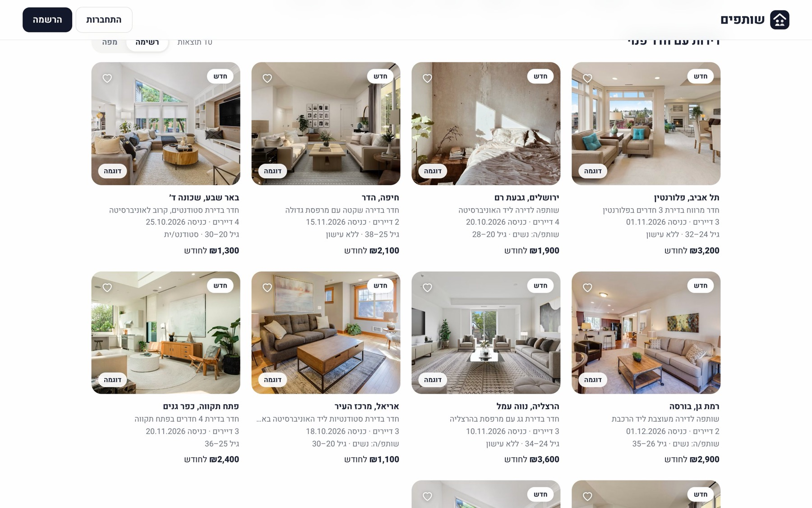
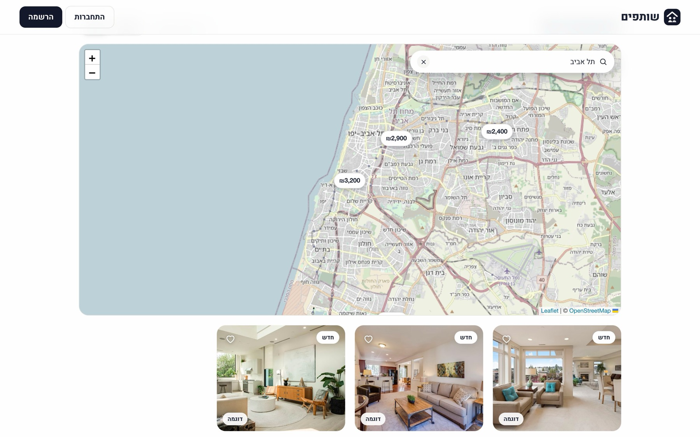
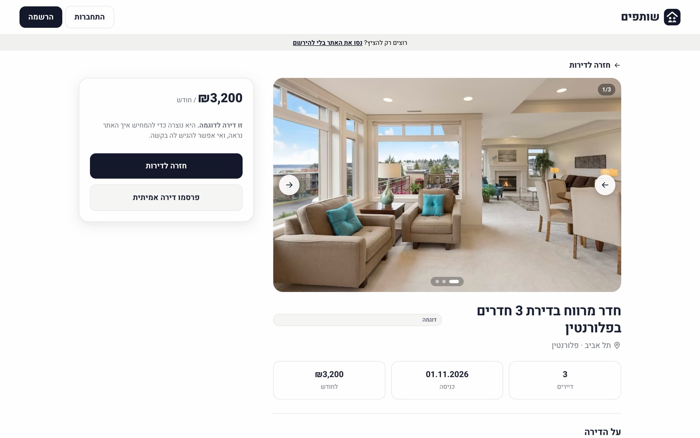
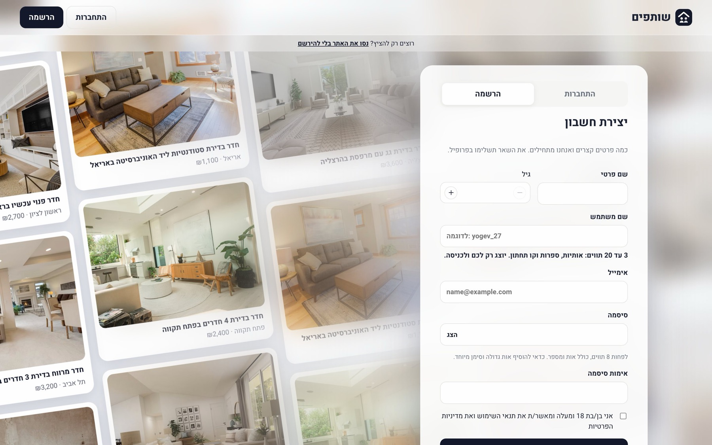
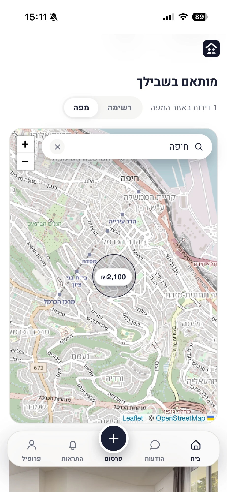

# שותפים – מצאו שותפים לדירה

אתר חינמי למציאת שותפים לדירה: מפרסמים חדר או דירה עם תמונות וקריטריונים, מי שמתאים מגיש בקשה, ואחרי היכרות בצ'אט באתר בעל הדירה מאשר. בלי מספרי טלפון ובלי כסף שעובר דרך האתר.

**לצפייה באתר:** https://shutafim.netlify.app (אפשר ללחוץ "נסו את האתר בלי להירשם")

> **English summary:** a free roommate-finding web app (Hebrew, RTL). React + Vite on the front end, Supabase (Postgres with row level security, Auth, Storage, Realtime) as the backend, deployed on Netlify. Posters publish rooms with photos and criteria, seekers apply, owners screen applicants through an in-site chat and then approve. Includes map search, notifications, report/block moderation and an installable mobile web app.

## צילומי מסך

  
  

  
  

  

**באייפון** (האתר מותקן כאפליקציה במסך הבית)

  
  
  
  

## מה יש באתר

- **פרסום דירה:** תמונות (כולל HEIC מהאייפון, מכווצות בדפדפן), קריטריונים לשותף, דיירים קיימים, כניסה מיידית, מיקום משוער במפה. עריכה, ארכיון ותפריט שלוש נקודות.
- **חיפוש:** סינון לפי עיר ושכר דירה, אחוז התאמה לפי הפרופיל, מועדפים, וחיפוש במפה שמתעדכן לפי האזור שרואים.
- **תהליך בקשה:** בקשה עם הודעה, בעל הדירה בוחן מועמדים, צ'אט כשלב היכרות, ואישור כניסה סופי נפרד שמעביר את הפוסט לארכיון.
- **הודעות והתראות בזמן אמת:** חלונות צ'אט צפים במחשב, חלון שמתמזער לבועה בטלפון, צלילים ורטט, פעמון עם פעולות מהירות.
- **משתמשים:** הרשמה עם אימות מייל, התחברות בשם משתמש, פרופיל חובה לפני פעולה, סינון קללות.
- **בטיחות:** דיווח וחסימה, עמוד ניהול דיווחים בעברית פשוטה, הרשאות ברמת השורה במסד הנתונים.
- **מצב אורח:** צפייה והתנסות על נתוני דמו בדפדפן בלבד, בלי יכולת לפרסם או לדווח.
- **חוויית נייד:** סרגל תחתון צף, גרירה לרענון, אפליקציה מותקנת במסך הבית, שדות שלא מגדילים את המסך באייפון.

## טכנולוגיות

React 18 · Vite · React Router · Leaflet + OpenStreetMap · Supabase (Postgres, Auth, Storage, Realtime) · Netlify. הכול בתוכנית החינמית.

## איך זה בנוי

- **שני backends מאחורי ממשק אחד:** `src/api.supabase.js` לאתר החי ו-`src/api.local.js` לדמו ולמצב אורח (נתונים ב-localStorage). `src/api.js` בוחר ביניהם, כך שהקוד של המסכים לא יודע על ההבדל.
- **אבטחה במסד הנתונים:** כללי RLS מגדירים מי רואה ומי כותב מה (למשל רק משתתפי שיחה כותבים בה, וחסימה מונעת בקשות והודעות). פונקציות עם `security definer` מוגבלות למה שנחוץ. המפתח היחיד באתר הוא המפתח הציבורי, ו-`service_role` לא נמצא בשום מקום.
- **מיגרציות:** התיקייה `supabase/migrations` מכילה את כל שלבי המסד לפי סדר (משתמשים, התראות, בטיחות, ניהול, חיזוק אבטחה).
- **תחזוקה:** משימת GitHub Actions (`.github/workflows/keep-alive.yml`) שולחת בקשה יומית כדי שפרויקט Supabase החינמי לא יירדם.

## הרצה מקומית (מצב דמו, בלי הגדרות)
    npm install && npm run dev

## עלייה לאוויר – הכול חינם
1. **Supabase** (supabase.com) → New project → SQL Editor → הדביקו והריצו את `supabase/schema.sql`.
2. Authentication → URL Configuration → הוסיפו את כתובת האתר שלכם ל-Site URL.
3. Project Settings → API → העתיקו `URL` ו-`anon key` לקובץ `.env` (לפי `.env.example`).
4. **Cloudflare Pages** או **Netlify** → חברו ריפו ב-GitHub, Build: `npm run build`, Output: `dist`, והוסיפו את אותם שני משתנים.

מגבלות החינמי של Supabase: 500MB מסד, 1GB תמונות. התמונות מכווצות בדפדפן כדי להאריך את זה.

## מצב אורח
כשמחוברים ל-Supabase, מי שלא רשום יכול ללחוץ "נסו את האתר בלי להירשם". זה מפעיל את מצב הדמו (נתונים מקומיים בדפדפן בלבד), בלי לגעת במסד האמיתי.

## משתני סביבה ב-Netlify
Site configuration → Environment variables:
- `VITE_SUPABASE_URL`
- `VITE_SUPABASE_ANON_KEY` (מפתח publishable בלבד, לעולם לא secret / service_role)

המשתנים נכנסים לאתר בזמן הבנייה, ולכן אחרי שינוי צריך לבנות מחדש (Deploys → Trigger deploy).
